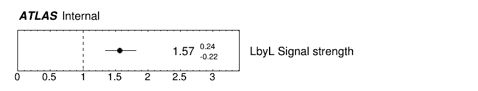

# TRExFitter for LbyL analysis, significance study and ALPs search 

TRExFitter is a popular framework used to perform profile likelihood fits in analyses within the ATLAS experiment. It takes ROOT histograms or ntuples as input.

In our case, we are looking to use TRExFitter in order to: 

1- Apply a profile likelihood fit over our data in order to study the signal strength (parameter of interest) of our Light-by-light signal and the impact of the systematic uncertainties (parameters of nuissance) over our signal

2- Study the significance of the Light-by-light scattering process

2- Search for Axion-Like-Particules by setting limits to the cross section of their production through the channel (γγ → a → γγ)

## Compilation

After getting the code for TRExFitter from the [gitlab website](https://gitlab.cern.ch/TRExStats/TRExFitter), we need to set it up, build it and compile it following the steps in the README file within the same site.

Once it has already been compiled a first time, at each new use, we run the script `source.sh`:

```
source setup.sh
```

Then we recompile the code using the alias defined in the `setup.sh` script:

```
trex-make
```

**Important:**

From this point on, any script needs to be run while being located in the `TRExFitter` directory since relative paths were used.


## How to
To run the code, after compiling, use the command:

```
trex-fitter <action(s)> <config file> [<options>]
```

The configuration file (`<config file>`) is a text file containing all the information on the definition of samples and fit regions, including all the fit and draw options.

## Inputs preparation 

**Note before anything:**

Before providing TRExFitter with histograms i.e signal, background, systematic uncertainties etc, it is crucial to ensure that the systematic uncertainties are summed with the signal. In other words, the `systematic_uncertainties_given_to_TRExFitter = systematic_uncertainties + signal`. Note that sometimes, your root files may have the systematic_uncertainties already summed with the signal, i.e you just need to use your histograms with no more modification, however this is not the case in here.

To achieve this, a Python file `prepareHistograms/SystematicsSummed.py` has been created. The file performs the summation of the systematic uncertainties with the signal, bin by bin. 

*Example:*

For example, in our case, the first bin of the mass signal has y=2.624, and the first bin of the systematic with the name signal_sys_PH_RECOeta is y=0.2322 (this is after taking the absolute value). After performing the summation, the new signal_sys_PH_RECOeta_largesummed has for the first bin y=2.8562. A similar thing has to be done for the rest of the bins and systematic uncertainties histograms.

**Inputs:**

Main inputs are stored in the Inputs folder as ROOT files which contain either histograms or ntuples.

Initially, inputs for data, LbyL signal and QED & CEP backgrounds are stored in the `Inputs/signal_hists.root` file as histograms.
Inputs for the ALP signal are stored within the `Inputs/ALP_samples` folder in ROOT files for samples generated at different m_a values as ntuples (Samples for m_a = 6-20 (1GeV spaced) 20-100 (10GeV spaced)).

We need to create weighted histograms from the ntuples for the invariant mass distribution of ALP samples (these histograms are subsequently stored within the signal_hists.root file).


In order to do so, a python script within the directory for histogram preparation `prepareHistograms/ALPhistos.py` is used, as it reads form  the ntuples and make the histograms from a nominal distribution then apply the weight and selection necessary. 


```
...
tree.Draw("Mass>>massScaled"+var, "weight*(aco<0.01)")
...
```
To apply the weight, we use the setting "weight*(aco<0.01)", the acoplanarity selection is applied too (aco<0.01).


Another python file `prepareHistograms/ALPsysthistos.py` is used in order to process the systematic uncertainties for the ALP samples same as discussed in the first paragraph of this section.


## **LbyL signal strength** 

**The blocks:**

For this part, we use the main config file `LbyL.config` located in the folder `TRExFitter/configfiles`

Our config file contains different blocks where we specify details, input our data, and determine the type of fit, among other things.

It begins with a `Job` block:

```
% --------------- %
% ---  JOB    --- %
% --------------- %

Job: "LbyL"
  Label: "Pb+Pb Collisions"
  CmeLabel: "5.02 TeV"
  POI: "mu"
  ReadFrom: HIST
  LumiLabel: "2.22 nb^{-1}"
  HistoPaths: "."
  HistoFile: "signal_hists"
  DebugLevel: 1
  SystControlPlots: TRUE
  SystErrorBars: FALSE  
  UseGammaPulls: TRUE
  MCstatThreshold: NONE
  RatioYmax: 2
  RatioYmin: 0
  PrePostFitCanvasSize:800,800
  LegendX1: 0.45
  RatioYtitle: Data / MC
```

In this block, we determine the name of our job; the labels we want to be put in our plots, including one for the center of mass energy, the luminosity; our parameter of interest; the types of input (histograms or ntuples); the path and name of the file for our inputs and many other details related mainly to our plots and uncertainties.


We also have a block for our `Regions` (Signal regions, control regions and validation regions) alongside a block for our `Samples`:

```
% % --------------- %
% % --- REGIONS --- %
% % --------------- %

Region: "Signal_region"
  Type: SIGNAL
  VariableTitle: "m_{\gamma\gamma}  [GeV]"
  LogScale: FALSE
  Ymin: 0
  YmaxScale: 1.5 # one means to stop at the highest one uncertainty included
  BinWidth: 1
  Binning: 5,6,7,8,9,10,11,12,13,14,15,16,17,18,19,20,21,22,23,24,25,26,27,28,29,30
  Label: "Signal region"

% --------------- %
% --- SAMPLES --- %
% --------------- %

Sample: "data"
    Type: DATA
    Title: "Data 2015 + 2018"
    HistoName: "mass/data"

Sample: "LbyLsignal"
  Type: SIGNAL
  HistoName: "mass/signal;1"
  Title: "Signal $(\gamma\gamma \rightarrow \gamma\gamma)$"
  FillColor: 0
  LineColor: 632
  
Sample: "CEP"
  Type: BACKGROUND
  HistoName: "mass/cep;1"
 ...
  LineColor: 1

Sample: "QED"
  Type: BACKGROUND
 ...


```

Then we have two important blocks, one for the `Fit` and one for the`NormFactor`, which is used to give details on our parameter of interest:

```
% --------------- %
% ----- FIT ----- %
% --------------- %
    
    Fit: "SPLUSB_CRSR"
    FitType: SPLUSB
    FitRegion: CRSR
    UseMinos: "mu"
    FitBlind: FALSE
    SetRandomInitialNPval: 0.1
    GetGoodnessOfFit: TRUE
    doLHscan: all
    LHscanMin: 0
    LHscanMax: 3

% --------------- %
% - NORMFACTORS - %
% --------------- %

NormFactor: "mu"
    Title: "#LbyL{#mu}"
    Title: "LbyL Signal strength"
    Nominal: 1
    Min: 0
    Max: 100
    Samples: LbyLsignal
```

In our `Fit` block, we determine the type of fit we are applying, a background-only or signal-plus-background fit); the regions where we are applying our fit; our parameter of interest; whether we are doing a fit over our real data or just an Asimov dataset alongside options for a likelihood scan and much more.

Finally, we have the `Systematics` block, where we determine the systematic uncertainties and upon which sample there are applied.
```
% --------------- %
% - SYSTEMATICS - %
% --------------- %

Systematic: "EGSCALLALL"
    Title: "Energy Scale Efficiency"
    Type: HISTO
    Samples: signal
    Regions: Signal_region
    HistoFileUp: signal_hists
    HistoNameUp: EG_SCALE_ALL__1up_largesummed
    HistoNameDown: EG_SCALE_ALL__1down_largesummed
    Symmetrisation: TWOSIDED
    

Systematic: "PHRECOETA"
    Title: "Photon Reconstruction Efficiency"
    ...
    HistoNameUp: PH_RECOeta_largesummed
    Symmetrisation: ONESIDED
   
Systematic: ...
    ...
```

More details can be found here: [Settings for TRExFitter blocks
](https://trexfitter-docs.web.cern.ch/trexfitter-docs/settings/)

**TRExFitter commands:**

After compiling, we run several actions:


*Step 1: Read the histograms*

```
trex-fitter h configfiles/LbyL.config
```


*Step 2: Create the workspace*

```
trex-fitter w configfiles/LbyL.config
```

*Step 3: Produce the pre-fit plots*

```
trex-fitter d configfiles/LbyL.config
```


*Step 4: Perform the fit*

```
trex-fitter f configfiles/LbyL.config
```


*Step 5: Produce the post-fit plots*

```
trex-fitter p configfiles/LbyL.config
```

*Step 6: Produce the ranking plots*

```
trex-fitter r configfiles/LbyL.config
```

**Outputs:** 

The outputs after running our config files
through TRExFitter are stored in folders
named after the job of each config file,
representing different jobs for different
samples.

For each TRExFit object, a directory is created.
Inside this directory, at every step, some outputs are created, following the structure described above:

| **Folder** | **Content** |
| ---------- | ----------- |
| `Plots/`              | data/MC plots, pre- and post-fit, for all the Signal, Control and Validation regions, including the summary plots |
| `Tables/`             | tables in txt and tex format |
| `RooStats/`           | workspace(s) and the xmls |
| `Fits/`               | output from fits |
| `Limits/`             | outputs from the limit-setting code |
| `Significance/`       | outputs from the significance code |
| `Systematics/`        | plots for the syst variations |
| `Histograms/`         | root file(s) with all the inputs |
| `LHoodPlots/`         | likelihood scan with respect to the specified parameter |


For example one of the many outputs we get after following these steps, is the following plot describing our `NormFactors` block which represents our parameter of interest, the Light-by-light signal strength: 




## **LbyL significance study & likelihood scan:** 


For this analysis, we have two config files. One which apply a signal-plus-background fit `LbyL.config`, and another one for an Asimov fit `LbyLexp.config`.

The most important part in our config file is within the Fit block:

```

% --------------- %
% ----- FIT ----- %
% --------------- %
    
    Fit: "SPLUSB_CRSR"
    FitType: SPLUSB
    FitRegion: CRSR
    UseMinos: "mu"
    FitBlind: FALSE
  ...
    doLHscan: all
    LHscanMin: 0
    LHscanMax: 3
```

In order to get results for a likelihood scan, we add the following settings to our Fit block `do LHscan:`, `LHscanMin` and `LHscanMax`.

To fit on an Asimov dataset, we need to set the setting `FitBlind` to `TRUE`

**TRExFitter commands:**

As discussed before in order to run several actions with the TRExFitter framework, we need to compile it.


*Step 1: Read the histograms*

```
trex-fitter h configfiles/LbyL.config
trex-fitter h configfiles/LbyLasimov.config
```


*Step 2: Create the workspace*

```
trex-fitter w configfiles/LbyL.config
trex-fitter w configfiles/LbyLasimov.config
```


*Step 3: Perform the fit*

```
trex-fitter f configfiles/LbyL.config
trex-fitter f configfiles/LbyLasimov.config
```


*Step 4: Study the significance*

```
trex-fitter s configfiles/LbyL.config
trex-fitter s configfiles/LbyLasimov.config
```

**Outputs:** 

For the likelihood scan, we can locate them stored in a
.yaml file saved within a sub-folder `LHoodPlots` inside
our job folder.

**Plotting:**

We then proceed to extract the likelihood scan values for each step, then multiply by two (since we get values for a negative loglikelihood function '-ΔlnL' and we need values for '-2ΔlnL').

Afterwards, using the TGraph class,  we plot the values for both scan of likelihood in the same canvas in order to compare them, then we add the significance dashed horizontal lines.

All this is done through a python script `source/LHscan.py` 

## **ALPs search and upper limits plots:**

For this analysis, we have multiple config files, that are used to set limits on the production of ALPs. Each config file matches  sample associated with
a specific axion mass m_a.

The most important thing to remember is that our LbyL signal in the previous config files becomes a background, and the signal is represented by the ALP hypothetical signal.


**TRExFitter commands:**


*Step 1: Read the histograms*

```
trex-fitter h configfiles/ALPs/axion_ma_8.config
```


*Step 2: Create the workspace*

```
trex-fitter w configfiles/ALPs/axion_ma_8.config
```


*Step 3: Perform the fit*

```
trex-fitter f configfiles/ALPs/axion_ma_8.config
```


*Step 4: Calculate the upper limits*

```
trex-fitter l configfiles/ALPs/axion_ma_8.config
```

**Outputs:** 

The outputs after running our config files
through TRExFitter are stored in folders
named after the job of each config file,
representing different jobs for different
samples.

For the upper limits (and other statistical
results), we can locate them stored in a
ROOT file saved within sub-folders inside
our job folder `ALP8/Limits/asymptotics/myLimit_CL95.root`.

Within the ROOT file, there are multiple
ntuples used to store values from statistical results.
The ones we are interested in include observed and expected upper limits, along with
uncertainties of ±1σ and ±2σ for the expected upper limits.

**Plotting:**

We then proceed to extract extract values
from these ntuples running a script `sigmaCLsplot.py` that
draws histograms from these
ntuples, calculates the mean values
from these histograms, and stores
them in lists (with each list
representing each upper
limit/uncertainty).

The next step consists of converting the upper limits we found for the signal strength µ to
upper limits on the cross section σ_a of the process γγ → a → γγ and the coupling
constant of ALPs 1/Λ_a .
For the upper limits on the cross section, we
calculate them as follows:
σ_a (γγ → a → γγ) = µ_CLs × σ_gen

The cross sections for some of the generated
samples are stored in a .dat file `Inputs/alpgeneratedcrosssection.dat`.

Then, we use the values calculated and stored in lists to create Control Limits plots using
the TGraphAsymmErrors class in ROOT and the AtlasPlots module.

All this steps were done using the same script `source/sigmaCLsplot.py` used to extract values from the ntuples within the ROOT file in order to plot the upper limits of the cross section of ALPs.

For the upper limits on the ALPs coupling constant, the procedure is similar. We calculate the square root of our upper limits on µ and divide them by the
gen
coupling constant for generated ALPs, Λ_gen = 1000 GeV, using the following formula:
1/Λ_a = sqrt(µ_CLs) × 1/Λ_gen

A similar python `LambdaCLsplot.py` that extract the same values as the previous one and calculate the values for the coupling constant then does the plotting is used.

There is a variation of this code that gives us a plot with two logarithmic axis `source/LambdaCLslogplot.py`.

 


